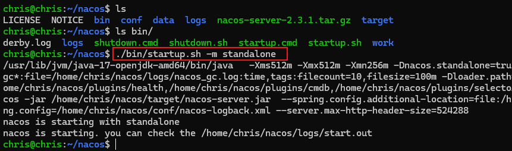
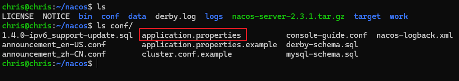
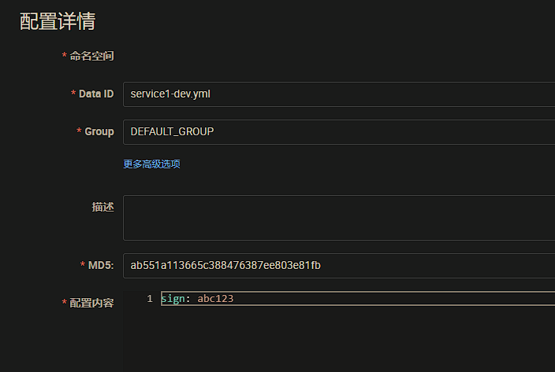

<h1>nacos-study</h1>

[官方文档](https://nacos.io/docs/latest/what-is-nacos/)

# 说明

Nacos /nɑ:kəʊs/ 是 Dynamic Naming and Configuration Service的首字母简称，一个更易于构建云原生应用的动态服务发现、配置管理和服务管理平台。

服务（Service）是 Nacos 世界的一等公民。Nacos 支持几乎所有主流类型的“服务”的发现、配置和管理：

- Kubernetes Service

- gRPC & Dubbo RPC Service

- Spring Cloud RESTful Service

我们一般都是 Feign 来调用其他微服务。Feign 实际上是基于 Java 的 HTTP 客户端实现，通常是基于 JDK 内置的 HttpURLConnection 或者是其他第三方的 HTTP 客户端库（如 Apache HttpClient、OkHttp 等）来实现 HTTP 请求和响应的处理。可以帮助开发者轻松地定义和使用 RESTful 服务。

# Nacos-Server

## [启动](https://nacos.io/docs/latest/quickstart/quick-start/)

github 下载 release 解压后，通过 bash 命令启动即可。下面是指定了单机模式启动：

```bash
./bin/startup.sh -m standalone
```




访问 `http://localhost:8848/nacos` 即可看到控制台。

## [配置](https://nacos.io/docs/latest/plugin/auth-plugin/)

conf 下的 `application.properties` 可以修改一些配置，如：鉴权、加密等



# 服务发现

添加 Maven 依赖，[注意版本搭配](https://github.com/alibaba/spring-cloud-alibaba/wiki/%E7%89%88%E6%9C%AC%E8%AF%B4%E6%98%8E)

```xml
<!-- nacos -->
<dependency>
    <groupId>com.alibaba.cloud</groupId>
    <artifactId>spring-cloud-starter-alibaba-nacos-discovery</artifactId>
    <version>${nacos.version}</version>
</dependency>
```

配置 yml

```yaml
spring:
  application:
    name: service1
  cloud:
    nacos:
      discovery:
        server-addr: localhost:8848 # nacos-server 地址
        namespace: 64fdb273-b072-4ea9-b3c4-c692f009dae3 # 不同命名空间不可通过服务名互相调用
        group: service # 不同分组不可通过服务名互相调用
```

在启动类上添加 `@EnableDiscoveryClient` 注解，启动后就可以在 nacos 控制台 - 服务列表 里看到名为 `service` 的服务。

# OpenFeign

添加 Maven 依赖

```xml
<!-- openfeign -->
<dependency>
    <groupId>org.springframework.cloud</groupId>
    <artifactId>spring-cloud-starter-openfeign</artifactId>
</dependency>
```

==注意：group 和 namespace 不同的服务，不能通过 服务名 互相调用（但是可以指定 url 调用）。==

```java
@FeignClient(name = "service-test")
public interface ExampleClient {
    @GetMapping("/service")
    JSONObject getService();

}
```

OpenFeign 可以通过 configuration 参数配置请求拦截器、异常处理、超时机制、重试机制等。

```java
package org.example.service1.client.config;

import feign.*;
import feign.codec.ErrorDecoder;
import org.apache.http.HttpStatus;
import org.springframework.context.annotation.Bean;
import org.springframework.context.annotation.Configuration;

import java.util.concurrent.TimeUnit;

/**
 * @author dlz
 * @since 2024/03/05
 */
@Configuration
public class ExampleConfiguration {

    /**
     * 请求拦截.
     */
    @Bean
    public RequestInterceptor requestInterceptor() {
        return new ExampleInterceptor();
    }

    /**
     * 异常处理.
     */
    @Bean
    public ErrorDecoder errorDecoder() {
        return new ExampleErrorDecoder();
    }

    /**
     * 超时配置.
     */
    @Bean
    public Request.Options options() {
        return new Request.Options(5, TimeUnit.SECONDS, 10, TimeUnit.SECONDS, true);
    }

    private static class ExampleInterceptor implements RequestInterceptor {
        @Override
        public void apply(RequestTemplate template) {
            template.header("Authorization", "Bearer token");
        }
    }

    private static class ExampleErrorDecoder implements ErrorDecoder {

        @Override
        public Exception decode(String methodKey, Response response) {
            final int status = response.status();
            return switch (status) {
                case HttpStatus.SC_NOT_FOUND -> throw new RuntimeException("资源服务器-未找到");
                case HttpStatus.SC_INTERNAL_SERVER_ERROR -> throw new RuntimeException("资源服务器-异常");
                default -> FeignException.errorStatus(methodKey, response);
            };

        }
    }

}

```

# 动态配置服务

添加以下 Maven 依赖

```xml
<dependency>
    <groupId>com.alibaba.cloud</groupId>
    <artifactId>spring-cloud-starter-alibaba-nacos-config</artifactId>
    <version>${nacos.version}</version>
</dependency>
<dependency>
    <groupId>org.springframework.cloud</groupId>
    <artifactId>spring-cloud-starter-bootstrap</artifactId>
</dependency>
```

资源文件配置要做一下调整，添加 `bootstrap.yml`  是为了启动时候就加载远端配置

application.yml

```yaml
server:
  port: 8001
  servlet:
    context-path: /

spring:
  profiles:
    active: '@profileActive@'
```

application-dev.yml

```yaml
sign: abc
```

bootstrap.yml

```yaml
spring:
  application:
    name: service1
  profiles:
    active: '@profileActive@'
```

bootstrap-dev.yml

```yaml
spring:
  cloud:
    nacos:
      discovery:
        server-addr: localhost:8848
      config:
        server-addr: localhost:8848
        file-extension: yml
```

Controller加上 `@RefreshScope` 注解

```java
@RestController
@RequestMapping("service1")
@RefreshScope
public class Service1Application {
    @Value("${sign}")
    private String sign;
    
    @GetMapping("sign")
    public Object sign() {
        return JSONUtil.createObj().set("status", "ok")
                .set("message", "请求成功")
                .set("result", sign);
    }
}
```

初次请求返回

```json
{
	"status": "ok",
	"message": "请求成功",
	"result": "abc"
}
```

在 nacos 控制台 - 配置管理中添加配置并发布



再次请求返回

```json
{
	"status": "ok",
	"message": "请求成功",
	"result": "abc123"
}
```

